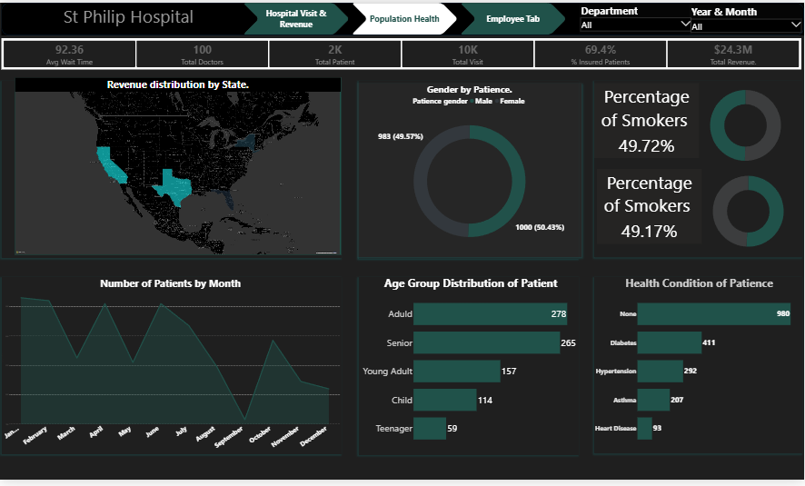
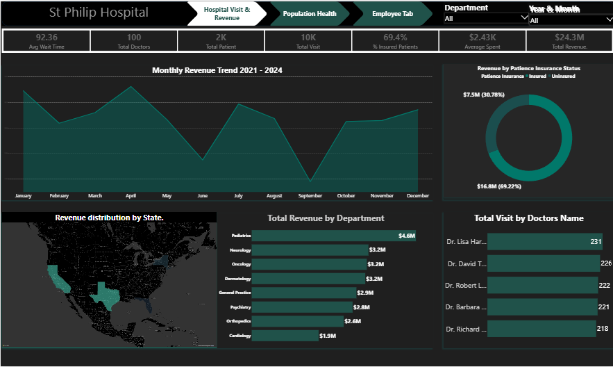

# St Philip Hospital — Healthcare Analytics Dashboard

## Overview
A multi-page interactive healthcare analytics dashboard built in Microsoft Power BI, analysing operational performance, population health trends, and workforce data for St Philip Hospital. The dashboard provides senior management with a single unified view of hospital activity, enabling data-driven decisions across patient care, revenue management, and staffing.

---

## Problem Statement
Hospital management required clear visibility into key operational metrics — including patient volumes, revenue distribution, departmental efficiency, and workforce performance — to identify bottlenecks, optimise resources, and improve patient outcomes. Raw data alone was insufficient for strategic decision-making without structured analysis and visual reporting.

---

## Tools & Techniques
- **Microsoft Power BI** — dashboard development and visualisation
- **Power Query** — data transformation and cleaning
- **DAX (Data Analysis Expressions)** — custom measures and calculated columns for KPIs
- **Data Modelling** — table relationships built to enable cross-filtering across pages
- **Real-world hospital dataset** — patient records, revenue data, and employee information

---

## Dashboard Pages

### Page 1 — Hospital Visit & Revenue

**Key Metrics:**
- Average Wait Time: **92.36 minutes**
- Total Doctors: **100**
- Total Patients: **2,000**
- Total Visits: **10,000**
- Total Revenue: **$24.3M**
- Insured Patients: **69.4%**

**Visuals:**
- Revenue distribution by US State — map visual identifying California and Texas as highest revenue-generating states
- Number of Patients by Month — area chart revealing seasonal patient volume fluctuations
- Age Group Distribution — Adults lead at 278, Seniors at 265, Teenagers smallest at 59
- Health Condition of Patients — horizontal bar chart covering hypertension, diabetes, and asthma

---

### Page 2 — Population Health

**Key Metrics:**
- Gender split: **983 male (49.57%)** vs **1,000 female (50.43%)**
- Percentage of smokers: **49.72%** and **49.17%** across patient segments

**Visuals:**
- Donut chart showing gender distribution
- Smoker percentage gauges — nearly half the patient population are smokers

---

### Page 3 — Employee Tab

**Key Metrics:**
- Doctor gender split: **54 male (54%)** vs **46 female (46%)**
- Average Spend: **$2.43K**
- Total Revenue: **$24.3M**

**Visuals:**
- Treemap of Years of Experience across specialities
- Top 10 Doctors by Patient Attendance
- Avg Effectiveness Satisfaction — Cardiology leads at **8.2**, Dermatology lowest at **7.3**
- Department summary table — Paediatrics handles highest patient load at **1,211 patients**

---

## Key Insights

| Insight | Finding |
|---|---|
| Revenue Concentration | California and Texas drive majority of revenue — geographic dependency risk |
| Seasonal Demand | Patient volumes peak March and September, dip May and July |
| Insurance Gap | 30.6% of patients are uninsured — revenue recovery opportunity |
| Paediatrics Under Pressure | Highest volume (1,211 patients) with capacity strain indicators |
| Cardiology Efficiency | Highest satisfaction (8.2) with smallest doctor count (8) |
| Smoking Prevalence | ~50% of patients are smokers — long-term condition management implications |

---

## Technical Highlights
- Built **DAX measures** for dynamic KPI calculations including average wait time, revenue totals, insurance percentages, and satisfaction scores
- Created **table relationships** enabling seamless cross-page filtering between patient, revenue, and employee datasets
- Designed **consistent dark theme UI** with teal accent colour scheme for professional visual clarity
- Implemented **navigation tabs** for multi-page user experience replicating enterprise dashboard standards

---

## What This Demonstrates
This project demonstrates the ability to take raw hospital data, model it relationally, apply DAX logic for meaningful KPIs, and present findings in a format that non-technical stakeholders — including hospital directors, finance leads, and HR managers — can act on immediately.

---

## Tools Used

---

## Author
**Vincent Idugboe-**
Data & Business Intelligence Analyst | Sheffield, UK

